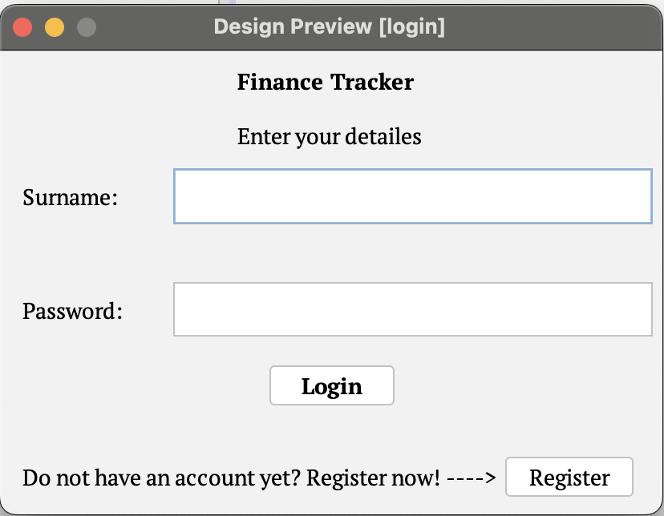
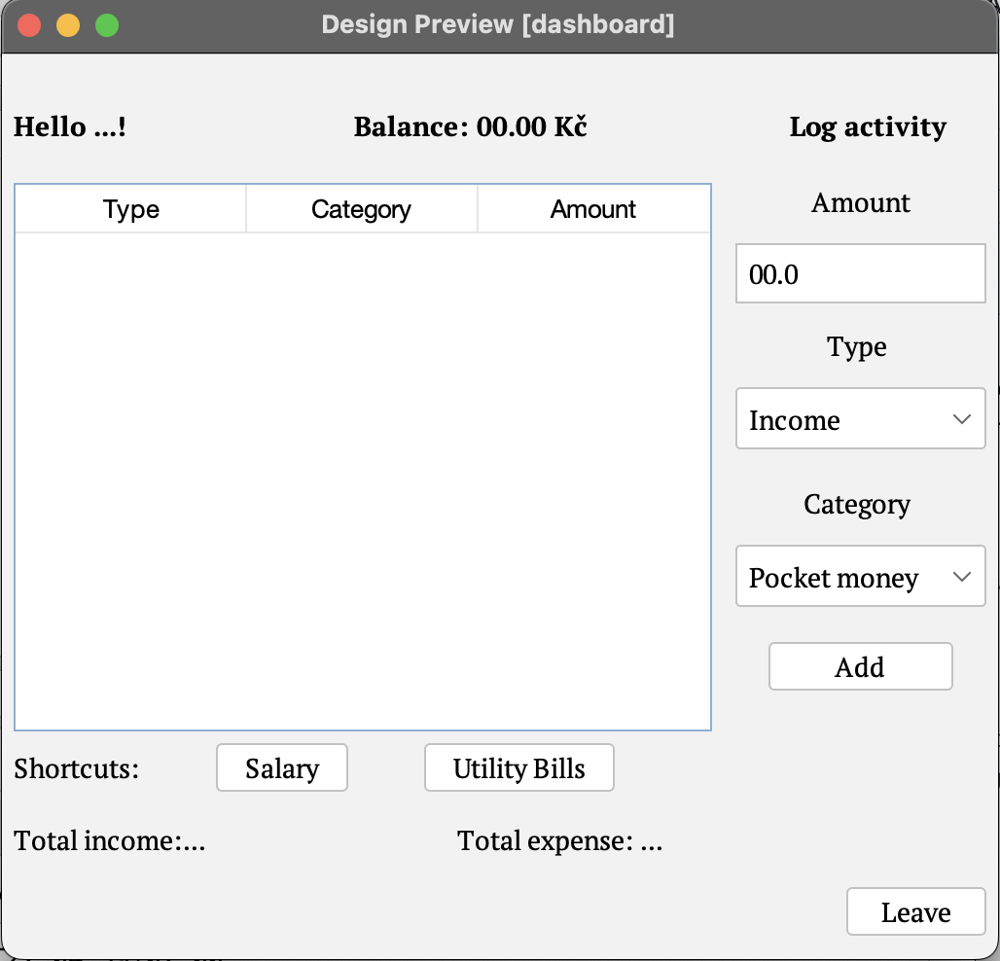
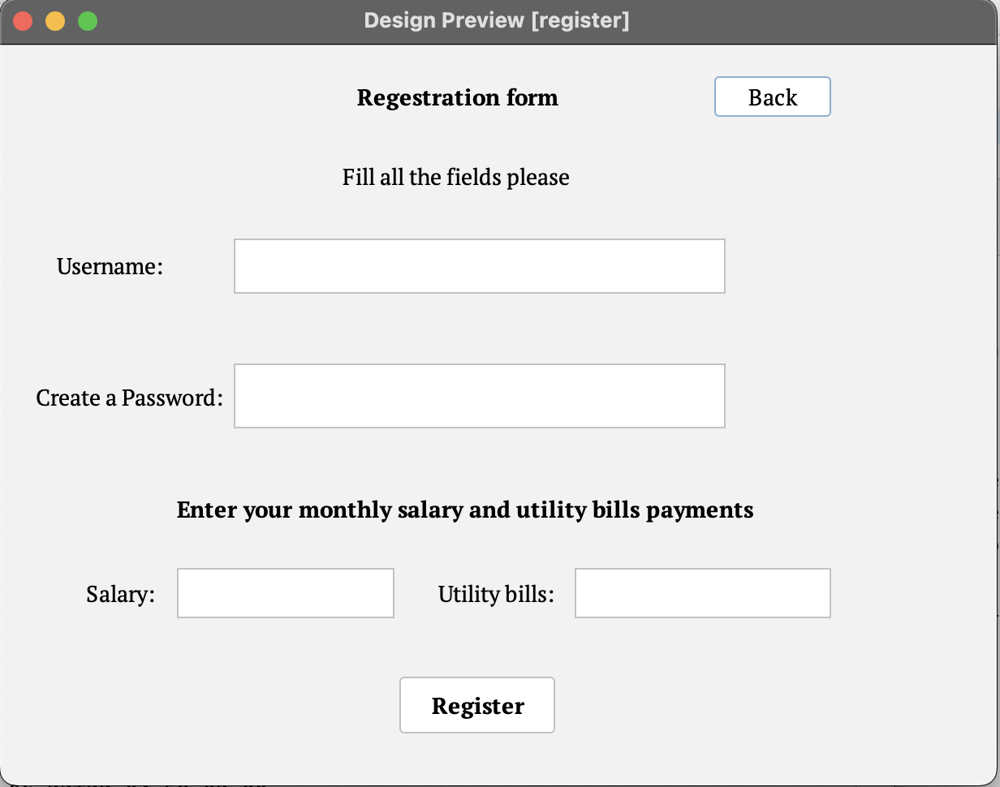

# Finance_Tracker_App
A desktop application developed in Java that helps users manage their personal finances by tracking income, expenses, recurring payments, and account balances.

## Screenshots

### Login Screen

### Dashboard

### Sign up

## Overview

Personal Finance Tracker was created as an Object-Oriented Programming project. The application allows users to register and log in, store financial transactions in a SQLite database, categorize income and expenses, and visualize spending habits through charts.

The goal of the project is to provide a simple and user-friendly tool for managing personal finances while demonstrating the use of Java, OOP principles, database management, and graphical user interfaces.

## Features

* User registration and login system
* Secure storage of user data
* Add, edit, and delete transactions
* Income and expense tracking
* Transaction categories
* Automatic balance calculation
* Recurring income and recurring expenses
* Transaction history table
* Spending visualization using charts
* SQLite database integration

## Technologies Used

* Java
* Java Swing
* SQLite
* JDBC
* NetBeans IDE
* Object-Oriented Programming (OOP)

## Database Structure

### Users Table

Stores information about registered users.

Fields:

* user_id
* username
* password

### Transactions Table

Stores financial transactions linked to users.

Fields:

* transaction_id
* user_id
* amount
* category
* type
* date
* description

## OOP Concepts Demonstrated

This project demonstrates several key Object-Oriented Programming concepts:

* Encapsulation
* Abstraction
* Inheritance
* Polymorphism
* Class decomposition
* Separation of concerns

Main classes include:

* User
* Transaction
* DatabaseManager
* LoginFrame
* RegisterFrame
* DashboardFrame

## Future Improvements

Possible future developments include:

* Monthly budget planning
* Export to CSV or Excel
* Data backup and recovery
* Multi-currency support
* Dark mode
* Advanced financial analytics
* Cloud synchronization

## Learning Outcomes

Through this project I gained experience in:

* Java application development
* GUI design with Swing
* Database design and SQL
* JDBC database connectivity
* Object-Oriented Programming
* Software testing and debugging
* Project planning and documentation

## Author

Created by Mariia Venherska as a school Computer Science project.

